# Library Management System - Docs

## Context diagram

```mermaid
graph RL

    %% System actors
    User(("👤<br>User")):::actor

    %% System - Use case container
    subgraph System["Library Management System"]
    end

    %% Interactions
    User -- Requests --> System
    System -- Data --> User

    %% Style
    classDef actor stroke:none,fill:none,font-size:20px
```



## Use Case diagram

```mermaid
graph LR

    %% System actors
    User(("👤<br>User")):::actor

    %% System - Use case container
    subgraph "Library Management System"

        space[ ]:::hide

        UC1([Create Book])
        UC2([List Books])
        UC3([List Authors])
        UC4([List Illustrators])
        UC5([List Genres])

        UC_SORT([Apply Sorting])
        UC_FILTER([Filter by Author])

        UC_SORT -. "<span><< Extend >></span>" .-> UC2
        UC2 -. "<span><< Include >></span>" .-> UC_FILTER
    end

    %% Relationship
    User ---> UC1
    User ---> UC2
    User ---> UC3
    User ---> UC4
    User ---> UC5


    %% Style
    classDef hide display:none;
    classDef actor stroke:none,fill:none,font-size:20px
```



## High-level view

```mermaid
graph LR

    %% System actors
    User(("👤<br>User")):::actor

    %% System - Use case container
    subgraph "Library Management System"
        
        %% Internal components
        API["<b>REST API</b><br/>(.NET / C#)"]
        Database[("<b>Database</b><br/>(MSSQL)")]
        
        %% Internal dataflow
        API -- "SQL" --> Database
    end

    %% Interactions
    User -- "HTTPS Request" --> API
    API -- "HTTPS Response (JSON)" --> User

    %% Style
    classDef actor stroke:none,fill:none,font-size:20px
```



## Detailed view - REST API (.NET / C#)

```mermaid
graph LR

    %% System actors
    User(("👤<br>User")):::actor
    Database[("<b>Database</b><br/>(MSSQL)")]

    %% REST API subsystem follows Clean Architecture principles
    subgraph "REST API (.NET / C#)"
        
        %% Api Layer
        subgraph "Api Layer"
            Controllers["<b>Controllers</b><br><small>HTTP Endpoints</small>"]
        end

        %% Application Layer
        subgraph "Application Layer"
            UseCases["<b>Use Cases</b><br><small>Business Logic</small>"]
            RepoInt["<b>Repository Interfaces</b><br><small>Abstractions</small>"]
            DTOs["<b>DTOs</b><br><small>Request/Response Objects</small>"]
            DI_Application["<b>Dependency Injection</b>"]
        end

        %% Domain Layer
        subgraph "Domain Layer"
            Models["<b>Models</b><br><small>Core Data Structure</small>"]
            Exceptions["<b>Exceptions</b>"]
        end

        %% Infrastructure Layer
        subgraph "Infrastructure Layer"
            DbContext["<b>EF Core</b><br><small>DbContext</small>"]
            RepoImpl["<b>Repository Implementations</b><br><small>Data Access</small>"]
            DI_Infrastructure["<b>Dependency Injection</b>"]
        end

    end

    %% Interactions
    User -- "HTTPS Request" --> Controllers
    Controllers -- "HTTPS Response (JSON)" --> User
    Controllers <-- "DTOs" --> UseCases
    RepoImpl -- Manipulate --> Models
    UseCases <-- "Models" --> RepoInt
    UseCases -- Mapping --> Models
    RepoInt -. "Implemented by" .-> RepoImpl
    RepoImpl  --> DbContext
    DbContext -- "SQL" --> Database

    %% Style
    classDef actor stroke:none,fill:none,font-size:20px
```



## Class diagram


## Dynamic view - Create a new valid book

```mermaid
sequenceDiagram
    autonumber
    
    actor User
    participant Controller as BooksController
    participant UC as CreateBookUseCase
    participant IBookRepo as IBookRepository
    participant IIlluRepo as IIllustratorRepository
    participant IAuthRepo as IAuthorRepository
    participant IGenRepo as IGenreRepository
    participant Book as Book (Domain Model)

    User ->> Controller: POST /api/books (CreateBookRequestDTO bookDTO)
    activate Controller
    Controller ->> UC: ExecuteAsync(bookDto)
    activate UC

    %% Checking ISBN uniqueness
    UC ->> IBookRepo: ExistsByIsbnAsync(isbn)
    IBookRepo -->> UC: false
    
    UC ->> IBookRepo: IsDuplicateAsync(title, year, authors)
    IBookRepo -->> UC: false

    %% Getting entities linked to Book entity
    UC ->> IIlluRepo: GetByIdAsync(illustratorId)
    IIlluRepo -->> UC: illustrator instance

    loop foreach authorId in AuthorIds
        UC ->> IAuthRepo: GetByIdAsync(id)
        IAuthRepo -->> UC: author instance
    end

    loop foreach genreId in GenreIds
        UC ->> IGenRepo: GetByIdAsync(id)
        IGenRepo -->> UC: genre instance
    end

    %% Creating the new book object (model)
    UC ->> Book: instantiate with data
    activate Book
    Book -->> UC: book instance
    deactivate Book

    UC ->> Book: Validate()
    activate Book
    Note right of Book: Domain Rules Check
    Book -->> UC: void (Success)
    deactivate Book

    %% Making the new book persistent
    UC ->> IBookRepo: CreateAsync(book)
    activate IBookRepo
    IBookRepo -->> UC: createdBook
    deactivate IBookRepo

    %% Response
    UC -->> Controller: CreateBookResponseDTO
    deactivate UC
    Controller -->> User: 200 Success (JSON)
    deactivate Controller
````
