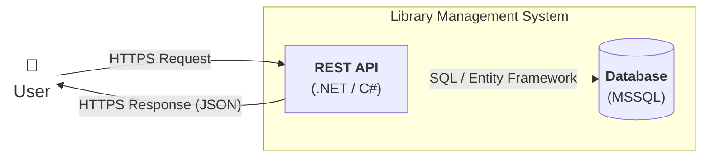
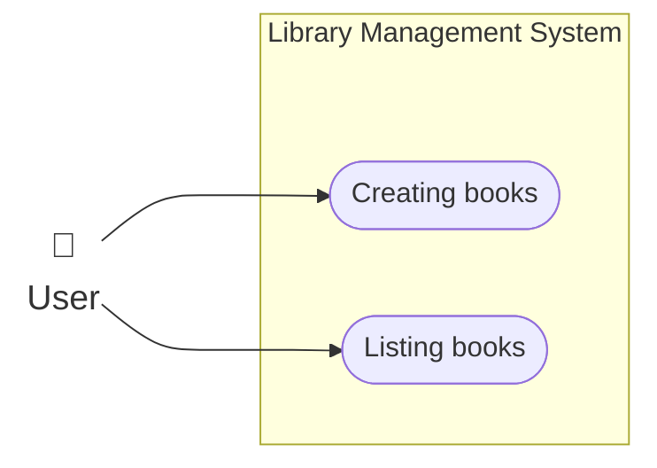

# Library Management System - Docs

## Context diagram

```mermaid
graph LR

    %% System actors
    User(("👤<br>User")):::actor

    %% System - Use case container
    subgraph "Library Management System"
        
        %% Internal components
        API["<b>REST API</b><br/>(.NET / C#)"]
        DB[("<b>Database</b><br/>(MSSQL)")]
        
        %% Internal dataflow
        API -- "SQL / Entity Framework" --> DB
    end

    %% Relationship
    User -- "HTTPS Request" --> API
    API -- "HTTPS Response (JSON)" --> User

    %% Style
    classDef actor stroke:none,fill:none,font-size:20px
```

## Use case diagram

```mermaid
graph LR

    %% System actors
    User(("👤<br>User")):::actor

    %% System - Use case container
    subgraph "Library Management System"

        space[ ]:::hide

        UC1([Creating books])
        UC2([Listing books])
    end

    %% Relationship
    User ---> UC1
    User ---> UC2

    %% Style
    classDef hide display:none;
    classDef actor stroke:none,fill:none,font-size:20px
```
